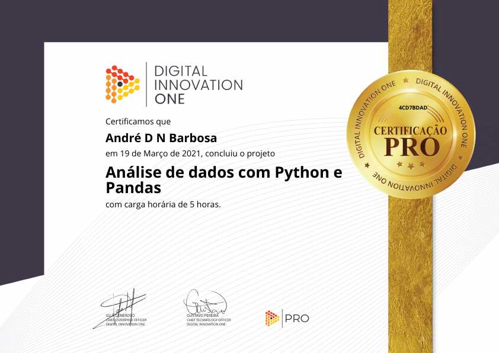
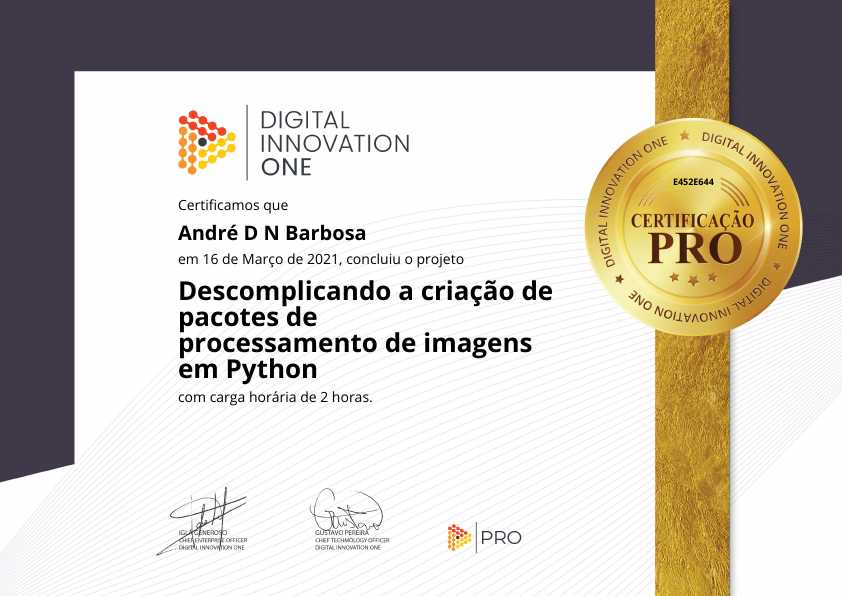
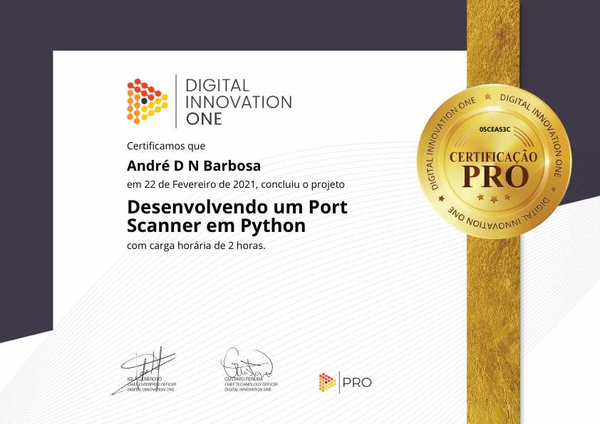
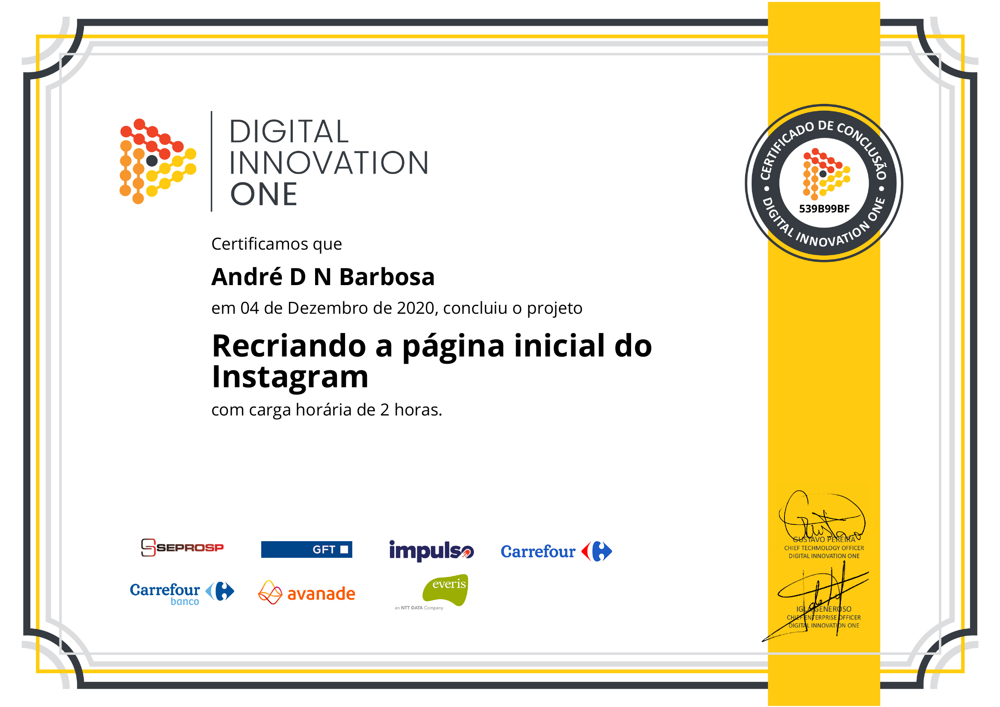
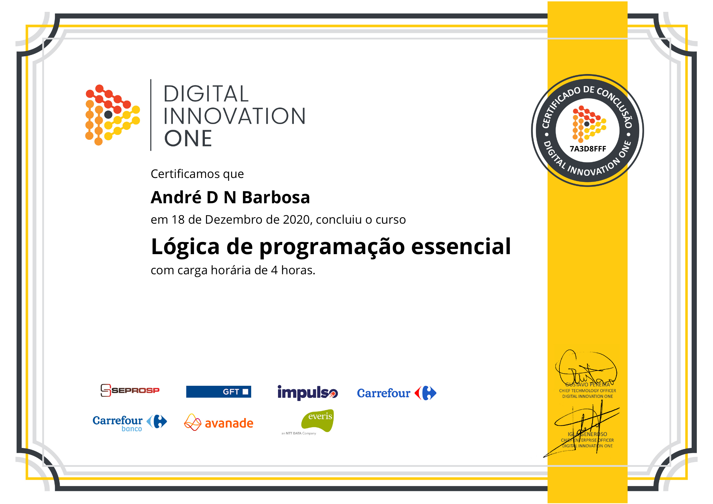

# Apresentação

Olá, me chamo <b>André Dimas Narciso Barbosa</b>.
 
Tenho 20 anos e estudo Sistemas de Informação na [Faculdade Impacta de Tecnologia](https://impacta.edu.br) e sou apaixonado na área de tecnologia, principalmente em programação.

# Certificações

Como toda pessoa que sonha em ser um profissional de respeito dou bastante foco em meus estudos. 
A melhor maneira que encontrei de estudar, que funcionou muito bem (e que deve funcionar muito bem para pessoas como eu), foi "colocando a mão na massa", encontrei uma plataforma que me daria um norte que foi a Digital Innovation One.
Abaixo deixo meus certificados até o momento.

## Python

Python foi meu primeiro contato com o mundo da programação, comecei aprendendo a linguagens na matéria de programação da faculdade.

E esses são meus certificados extracurriculares.

 

## HTML & CSS

Meu primeiro contato com HTML e CSS foi em um curso que fiz durante minhas férias de 2020 na Danki Code, apesar de ainda estar cursando, já me sinto seguro para colocar meu conhecimento em prática.

 

 

## Javascript
Foi a segunda linguagem de programação que tive contato e o primeiro foi na faculdade, estou ainda me desenvolvendo com essa linguagem e acredito que logo vou poder dizer "Eu sei programar em Javascript".

 

## Outros
Desde pequeno sou apaixonado em tecnologia e sempre fui muito curioso no que se refere ao assunto, por isso sempre procuro me aprofundar naquilo que me desperta essa curiosidade e esse tópico são desses assuntos, e como todo conhecimento é sempre bem-vindo, aqui estão eles.

 

 

 

# Curtiu?
Esses são meus conhecimentos certificados, estou sempre procurando conteúdos bons para poder estudar e vou estar atualizando sempre este perfil.
Se você gostou e quer entrar em contato comigo pode me chamar no: 

<a href = "https://www.linkedin.com/in/andré-dimas-narciso-barbosa-030420196/"><a/>
<a href = "https://api.whatsapp.com/send?phone=5511984424320"><a/>
<a href = "https://api.whatsapp.com/send?phone=5511984424320"><a/>
